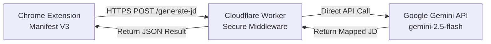

# RecruitIntel - Internal JD Generator & Sourcing Strategist

A production-ready Google Chrome Manifest V3 Extension backed by a remote Cloudflare Worker middleware. This tool securely transforms candidate-facing Job Descriptions or raw requirements into recruiter-aligned internal strategy maps using the Gemini API.

---

## Final Production Architecture



* **No Local Server**: Once deployed, there is no dependency on a local Node.js process, Python process, development server, or localhost. The extension communicates directly with Cloudflare's global edge network.
* **API Key Security**: The Gemini API Key is never saved in the extension frontend, popup files, or Git history. It exists **only** as a Cloudflare Worker Secret environment variable (`GEMINI_API_KEY`).

---

## Quick Setup & Deployment Guide

Follow these simple steps to configure and run the extension:

### Step 1: Deploy the Cloudflare Worker
1. Log into your [Cloudflare Dashboard](https://dash.cloudflare.com/) and navigate to **Workers & Pages**.
2. Click **Create Application** -> **Create Worker**.
3. Name your worker (e.g., `internal-jd-generator`).
4. Click **Deploy**.
5. Once deployed, click **Edit Code** in the top right corner.
6. Replace the boilerplate code in Cloudflare's online editor with the contents of [`worker/index.js`](file:///d:/Giftson/OneDrive - Global S3/Giftson Work Personal/Recruitment Improvement Project/New folder/worker/index.js).
7. Click **Save and Deploy**.

### Step 2: Configure the Gemini API Key Secret in Cloudflare
The worker needs a valid Gemini API Key stored in its environment secrets.
1. Obtain a free Gemini API key from [Google AI Studio](https://aistudio.google.com/).
2. In your Cloudflare Worker dashboard, go to the worker's **Settings** tab.
3. Select **Variables & Secrets** (or **Environment Variables**).
4. Click **Add Secret** (or **Add Variable**).
   - Set the name exactly as: `GEMINI_API_KEY`
   - Set the value to your Google Gemini API Key.
   - Click **Save / Encrypt**.

### Step 3: Link the Extension to your Deployed Cloudflare Worker
1. Find your Cloudflare Worker's HTTPS URL (visible in your Cloudflare dashboard after deployment, e.g., `https://internal-jd-generator.your-account.workers.dev`).
2. Open [`extension/popup.js`](file:///d:/Giftson/OneDrive - Global S3/Giftson Work Personal/Recruitment Improvement Project/New folder/extension/popup.js).
3. Find the configuration section at the top of the file:
   ```javascript
   // ==================================================
   // CONFIGURATION
   // ==================================================
   const API_ENDPOINT = "https://YOUR-WORKER-URL.workers.dev/generate-jd";
   ```
4. Replace `"https://YOUR-WORKER-URL.workers.dev/generate-jd"` with your actual Cloudflare Worker URL, appending `/generate-jd` at the end (e.g., `"https://internal-jd-generator.your-subdomain.workers.dev/generate-jd"`).

### Step 4: Load the Extension into Google Chrome
1. Open Google Chrome and navigate to: `chrome://extensions`
2. Enable **Developer Mode** by toggling the switch in the top right corner.
3. Click the **Load unpacked** button in the top left.
4. Select the **`extension/`** directory in your workspace folder.
5. Pin the **Internal JD Generator** extension to your Chrome browser toolbar.

---

## Sourcing Workflows & Features

### 1. Main Generator Screen
Click the RecruitIntel extension icon in your Chrome toolbar:
- **Role Name (Optional)**: Help the model specialize by entering the target title.
- **Location & Duration (Optional)**: Add metadata context to shape the leveling and sourcing maps.
- **Original JD / Requirements (Required)**: Paste the raw candidate-facing Job Description.
- **Generate Internal JD**: Submits details to the Cloudflare Worker, animates progress phases, and renders the result.

### 2. Output & Editing
Once generated:
- The output displays inside an **editable textarea** allowing recruiters to live-tweak sentences or keywords before exporting.
- **Copy**: Instantly copies the current, edited markdown text to your clipboard.
- **Regenerate**: Refreshes the AI generation using the original raw inputs.
- **New JD**: Clears results and inputs, transitioning back to the form workspace.

### 3. Sourcing Settings (Options Page)
To open the settings:
1. Click the **Gear Icon (⚙)** in the extension header, or right-click the extension icon and select **Options**.
2. **Job Format Prompt**: Edit guidelines controlling how the AI organizes the JD sections.
3. **Reset Default**: Restores the company's default 4-section format guidelines:
   - *Section 1*: As an [ROLE], you will (Responsibilities)
   - *Section 2*: What You Bring to the Table (Requirements, Years of Experience, Skills)
   - *Section 3*: You should possess the ability to (Capabilities)
   - *Section 4*: What we bring to the table (Factual environment details only)

---

## Development vs. Production

* **Local Development**:
  - The extension files are fully static. Simply open `settings.html` or `popup.html` locally in a browser to inspect HTML/CSS.
  - You can edit code locally and click "Reload" in `chrome://extensions` to update.
* **Production**:
  - Zero local terminal dependency.
  - Cloudflare Workers run on global edge nodes with automatic scaling.
  - Gemini API calls execute securely via HTTPS.
